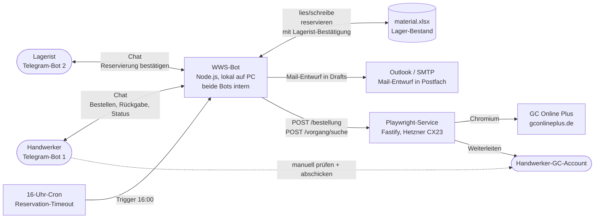
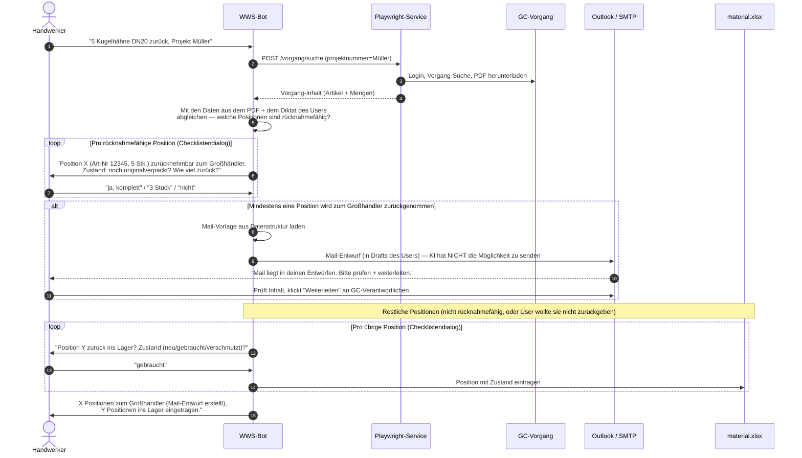

# WWS + Grosshandel-Service — Architektur

> Wird mit jeder Iteration mitgepflegt. Stand: 2026-09-05 (zweite Iteration: Regeldokument, Stateful-Warenkorb, IDS verworfen).
> Verantwortlich: User (Inhalt) + Mavis (Pflege, Diagramme).

## 1. Überblick (was in einem Satz)

WWS ist ein Telegram-Bot für Handwerker, der zwei große Workflows abbildet: **Einkauf** (Material rein → Bot fragt Lager → reserviert via Lagerist → ergänzt Rest aus Online-Shop → leitet Warenkorb an User-GC-Account) und **Rückgabe** (Material zurück → Bot sucht Original-Vorgang → vergleicht mit aktueller Bestellung → entweder Direkt-Rücknahme beim Großhändler oder zurück ins Lager). Reservierung im Lager ist dabei eine **Barriere**: reserviertes Material kann nicht einfach entnommen werden, nur über den Lageristen.

## 2. High-Level-Diagramm



## 3. Hauptworkflow 1: Einkauf (Phase 1: Direkt-Bestellung im Bau)

```mermaid
sequenceDiagram
    autonumber
    actor U as Handwerker
    participant B as WWS-Bot
    participant L as material.xlsx
    participant La as Lagerist
    participant S as Playwright-Service
    participant K as Katalog-Suche (JSON)
    participant G as GC-Portal
    participant A as Handwerker-GC-Account

    U->>B: "Bestell 5 Kugelhähne DN20, Projekt Müller"
    B->>B: Positionen klären (Rückfragen wenn nötig)
    B->>L: Lagerbestand prüfen
    L-->>B: "3 Kugelhähne da, 2 fehlen"
    B->>U: "Aus Lager: 3 (Achtung: schwer/neu zu bestellen?),<br/>neu bestellen: 2. Bestätigen oder anpassen?"
    U->>B: "Bestätigt" oder "5 neu bestellen, 0 aus Lager"
    B->>La: Reservierungs-Anfrage (Chat)
    Note over B,S: Phase 2 läuft PARALLEL — Wartezeit auf Lagerist nutzen
    par Während Lagerist prüft
        B->>K: Suche Artikelnummern für fehlende Positionen
        K-->>B: Vorschlag Artikelnummern
        B->>U: "Für die 2 fehlenden: Art-Nr 12345 (3,40€), Art-Nr 67890 (4,20€). Bestätigen?"
        U->>B: "ja"
        B->>S: POST /bestellung (kundennummer, positionen[])
        S->>G: Login, Warenkorb anlegen (Titel = Projekt Müller)
        loop Pro Position
            S->>G: "Artikel hinzufügen" → Art-Nr + Menge
        end
        Note over S,G: Warenkorb bleibt im Service (Bot hält die ID),
        wird noch NICHT weitergeleitet — kommt erst am Ende
    and Lagerist bearbeitet
        La->>B: Status (bestätigt | teilbestätigt | abgelehnt)
        alt bestätigt
            B->>U: "Lagerist hat 3 bestätigt."
        else teilbestätigt (z.B. nur 2 von 3)
            B->>K: Recherche für 1 fehlende Position
            B->>S: Update Warenkorb mit zusätzlicher Position
            B->>U: "Lagerist hat nur 2, ergänze um 1."
        else abgelehnt
            B->>K: Recherche für alle aus Lager geplanten
            B->>S: Update Warenkorb mit allen aus-Lager-Positionen
            B->>U: "Lagerist abgelehnt. Alles wird über Shop bestellt."
        end
    end
    Note over S,U: 16-Uhr-Cron: falls bis hier kein Lagerist-Status da war,
    Reservierung in material.xlsx stornieren + Warenkorb ergänzen
    S->>G: Warenkorb ist jetzt komplett
    S->>G: Hamburger → "Weiterleiten" → Handwerker-GC-Account
    S-->>B: Warenkorb weitergeleitet (jobId, screenshots)
    B->>U: "🛒 Warenkorb in deinem GC-Konto, prüfen + abschicken"
    U->>A: manuell einloggen, prüfen, "Bestellen"
```

## 4. Hauptworkflow 2: Materialrückgabe (Phase 2)



## 5. Komponenten

### 5.1 WWS-Bot (Telegram, lokal auf PC)

- **Was:** Node.js-Anwendung. Telegram-Chat, mehrere Rollen, Experten für verschiedene Workflows.
- **Telegram-Bots:** Der WWS-Bot betreibt **zwei Telegram-Bots** (unterschiedliche Tokens vom BotFather):
  - **Bot 1 — Handwerker-Bot** (`TELEGRAM_BOT_TOKEN`): antwortet dem Handwerker auf Bestellungen, Rückgaben, Statusabfragen
  - **Bot 2 — Lagerist-Bot** (`TELEGRAM_LAGER_TOKEN`): schickt Reservierungs-Anfragen raus, nimmt Bestätigungen/Teilbestätigungen/Ablehnungen entgegen
  - Die Logik läuft in **einem** Code-Repo (`experten/`), aber die zwei Bots sind nach außen getrennte Identitäten.
- **Rollen:**
  - **Handwerker** (Standard): Bestellt, gibt Material zurück, fragt Status ab
  - **Lagerist**: Bearbeitet Reservierungs-Anfragen über den Lagerist-Bot
  - **Admin**: Vergibt Rollen, pflegt Daten
- **Experten** (in `experten/`):
  - Bestehend: `lager`, `materialaufmass`, `recherche`, `lagerpflege`, `lagerauskunft`, `wissenspflege`, `bestellung` (Stub)
  - **Neu (Phase 1):** `grosshandel.js` — Bestell-Workflow
  - **Neu (Phase 2):** `materialrueckgabe.js` — Rückgabe-Workflow
  - **Neu (Phase 1.5):** Per-User-Stekbrief inkl. `gc_login_name`, `outlook_email`
- **Storage:**
  - `data/material.xlsx` — Lagerbestand (Schreib-Lock für Reservierung)
  - `data/users/<chatId>/steckbrief.json` — pro User (Rolle, GC-Name, Outlook)
  - `data/users/<chatId>/reservierungen/<id>.json` — Reservierungen (`id` = laufende Nummer `/NNNNNNN`)
  - `data/templates/ruecknahme_mail.txt` — Mail-Vorlage für Rücknahme (Phase 2)

### 5.2 Playwright-Service (Hetzner-Box)

- **Was:** Fastify-HTTP-Server. Nimmt Job-Payloads, öffnet Chromium, klickt durchs GC-Portal.
- **Hosting:** Docker-Container `grosshandel` auf Hetzner CX23, Helsinki, `2.29.36.221:8787`
- **Verzeichnis:** `/opt/grosshandel-service/`
- **Endpoints:**
  - `GET /health` — ohne Auth
  - `POST /login/:grosshaendler` — manueller Login-Trigger
  - `POST /bestellung` — Hauptjob: Warenkorb anlegen + befüllen + weiterleiten
  - `GET /job/:id` — Screenshots + Log zu einem Job
  - `POST /vorgang/suche` (Phase 2) — GC-Vorgang nach Projektnummer suchen, PDF lokal ablegen
- **Auth:** Bearer-Token (`SERVICE_TOKEN` in `.env`)
- **Pro Großhändler:** eigene `BrowserContext` mit persistenter `storageState` in `data/storage/<klein>.json`

### 5.3 Hetzner-Box

- **Specs:** CX23, 2 vCPU shared, 4 GB RAM, 40 GB SSD, 6,53 €/Monat
- **OS:** Ubuntu 26.04.1 LTS
- **Was läuft:** nur der Docker-Container
- **Firewall:** `ufw` — SSH + Port 8787 offen
- **HTTPS:** noch nicht, kommt vor Live-Gang (Caddy + Let's Encrypt)

### 5.3a Katalog-Volltext-Index (Phase 0 — fertig, Stand 2026-09-06)

- **Was:** Deterministische Text-Extraktion pro Seite aus den 15 Hersteller-PDFs (GC, RF, Sikla, Uni Elektro). 27.7 MB JSON über ~15 000 Seiten.
- **Wo:** `data/kataloge_index/<katalog>.json` — pro Katalog eine Datei
- **Skript:** `data/skripte/katalog_index_erstellen.py` (python + pdfplumber)
- **Such-API:** `lib/katalog_suche.js` — `findeSeiten(index, wortgruppen, opts)` und `findeInAllenKatalogen(indexDir, wortgruppen, opts)`
  - Input: `wortgruppen = Array<Array<string>>` — Wortkombinationen
  - **Innerhalb einer Kombination: UND** (alle Wörter müssen vorkommen)
  - **Zwischen Kombinationen: ODER** (mindestens eine muss passen)
  - Output: `Array<{seite: number, match: string[]}>` — Treffer mit der matchenden Wortgruppe
- **Wer entscheidet, welche Wortgruppen angefragt werden:** die **KI** im WWS-Bot, basierend auf Material-Beschreibung + Synonymen
- **Was die KI damit macht:** für eine Material-Anfrage ("5 Kugelhähne DN20 Rotguss") generiert sie Wortgruppen wie `[["Kugelhahn", "DN20"], ["Kugelhahn", "20"], ["Kugelhahn", "Rotguss"]]` und schickt sie an `findeSeiten()`. Das Ergebnis (Liste von Seitenzahlen) wird im Bot oder im Playwright-Flow weiterverarbeitet.
- **Größen-Konventionen pro Katalog** (für die KI wichtig beim Formulieren der Wortgruppen):
  - **DN** (Nennweite): Heizung, Lüftung, Installation, Wasserwelt, RF, Sikla, Elektromaterial
  - **mm** (Millimeter): Sanitär, Küchenarmaturen
  - **Zoll**: ältere Bezeichnungen, vereinzelt in Sanitär/Küche

### 5.4 GC-Gruppe-Portal (gconlineplus.de)

- **Login:** A3-Commerce-Formular. Username + Passwort, kein 2FA.
  - `#a3_inputName`, `#a3_inputPass`, `#a3_btnSubmit`
- **Cart-UI (Stepper 1.Produkte → 4.Zusammenfassung):**
  - Selektoren: `#PageOnlinePlusCartPositions_a<N>_…`
  - Hamburger-Menü → "Weiterleiten" → Empfänger → `#PromptBox_form_btnGrid_submit`
- **Vorgang-Suche** (Phase 2): Sidebar → "Vorgänge" → Suchfelder → "Filter/Suche" → PDF-Generierung
- **Session-Persistenz:** typischerweise einige Tage, in `data/storage/gc.json`

### 5.5 RNF (zweiter Großhändler, Phase 2)

- Eigene `selectors/rnf.yaml`, `RNF_USER`/`RNF_PASS` in `.env`
- Login-URL steht noch aus

### 5.6 Outlook-Integration (Mail-Versand)

- **Wofür:** Materialrückgabe-Mail-Entwurf für Handwerker (Phase 2)
- **Sicherheitsprinzip:** **Die KI hat KEINE Möglichkeit, Mails abzuschicken.** Sie erstellt nur den Entwurf im Postfach des Users. User prüft den Inhalt manuell und klickt "Weiterleiten" an den GC-Verantwortlichen.
- **API:** Outlook REST API (Microsoft Graph) oder einfacher SMTP
- **Setup:** Pro User `outlook_email` im Steckbrief, OAuth-Token in `data/users/<chatId>/outlook_token.json`

### 5.7 Cron / 16-Uhr-Timeout

- **Was:** Täglich um 16:00 prüft ein Cronjob alle offenen Reservierungen
- **Wenn älter als X Stunden ohne Lagerist-Antwort:** Reservierung in `material.xlsx` stornieren, Warenkorb im GC um die stornierten Positionen ergänzen
- **Wo:** Entweder im WWS-Bot (falls 24/7) oder in einem eigenen Container auf der Hetzner-Box

## 6. Datenstrukturen

### 6.1 Reservierung (im WWS-Bot)

```json
{
  "id": "6789123",
  "status": "offen" | "bestaetigt" | "teilbestaetigt" | "abgelehnt",
  "lagerist": "<chatId>",
  "erstelltAm": "2026-09-04T14:30:00Z",
  "erstelltVon": "<handwerker-chatId>",
  "positionen": [
    { "artikelnr": "12345", "menge": 3, "bezeichnung": "Kugelhahn DN20" }
  ],
  "lageristAntwort": null,
  "warenkorbImGc": "gc-1725451234-abcd",
  "cronFaelligAm": "2026-09-04T16:00:00Z"
}
```

### 6.2 User-Stekbrief

```json
{
  "rolle": "handwerker" | "lagerist" | "admin",
  "gc_login_name": "MARIOHENRICH",
  "gc_login_passwort": "<in .env, nie in JSON>",
  "outlook_email": "mario@beispiel.de",
  "outlook_token_ref": "outlook_token.json"
}
```

### 6.3 Service-Seite

- `selectors/gc.yaml` — pro Großhändler ein File mit Selektoren + URLs
- `data/storage/gc.json` — Browser-Session
- `data/screenshots/<jobId>/` — pro Job: Screenshots + `log.txt`
- `data/vorgaenge/<projektnummer>.pdf` — GC-Vorgang-PDF (Phase 2)

## 7. Entscheidungs-Log

| Datum | Entscheidung | Warum |
|---|---|---|
| 2026-09-04 | **1 WWS-Vorgang = 1 Warenkorb** | Saubere Trennung |
| 2026-09-04 | **Direkt-Eintrag statt CSV-Upload** | Deterministischer, schneller |
| 2026-09-04 | **Weiterleiten statt Auto-Abschicken** | Sicherheit: Mensch entscheidet |
| 2026-09-04 | **Cart an User-GC-Account, nicht festen Account** | User prüft in seinem gewohnten Account |
| 2026-09-04 | **Per-User Steckbrief beim ersten Start** | 30 Mitarbeiter = individuelle Accounts |
| 2026-09-04 | **Service auf Hetzner, Bot auf PC** | Hybrid: Bot schnell änderbar, Service stabil 24/7 |
| 2026-09-04 | **CX23 (6,53 €/mo), nicht CPX22** | Shared CPU reicht, spart 200 €/Jahr |
| 2026-09-04 | **Reservierung als Barriere, geht über Lagerist** | User kann nicht selbst an Reservierungen vorbei Material entnehmen |
| 2026-09-04 | **Phase 2 läuft parallel zur Lagerist-Prüfung** | Wartezeit nutzen, Bottleneck vermeiden |
| 2026-09-04 | **16:00-Fallback: stornieren + alles via Shop** | Garantie, dass Material am nächsten Tag ankommt |
| 2026-09-04 | **Outlook-Mail-Entwurf statt direkt senden** | User behält Kontrolle, muss nur "Weiterleiten" klicken |
| 2026-09-04 | **Warenkorb erst AM ENDE weiterleiten**, nicht parallel | Bei GC bedeutet "Weiterleiten" das Wandern von A→B, kein gleichzeitiges Existieren an zwei Orten. Solange der Bot Zugriff braucht (Updates nach Lagerist-Antwort), bleibt der Warenkorb beim Bot. Erst nach finaler Bestätigung (oder 16:00-Fallback) wandert er zum User. |
| 2026-09-04 | **Materialrückgabe ohne "Schnittmenge aktuelle Bestellung"** | Der Workflow ist unabhängig von der aktuellen Bestellung — der User diktiert was er zurückgibt, Bot gleicht mit dem historischen Vorgang ab. Falls rücknahmefähig, Mail an Großhändler; sonst ins Lager. |
| 2026-09-04 | **Zwei Telegram-Bots im selben WWS-Repo** | Handwerker-Bot und Lagerist-Bot sind getrennte Identitäten (unterschiedliche Tokens), aber dieselbe Codebasis. Reservierungs-Kommunikation läuft über den Lagerist-Bot, nicht über User-User-Direktnachrichten. |

## 8. Roadmap

### Phase 1 — Direkt-Bestellung (jetzt, Sep 2026)

- [ ] `gc.yaml` und `server.js` neu auf Stepper-UI
- [ ] Auf der Box testen (Login, Cart anlegen, Artikel, Weiterleiten)
- [ ] `experten/grosshandel.js` mit dem Service verbinden
- [ ] WWS-`.env` um `GROSSHANDEL_SERVICE_URL` + `GROSSHANDEL_SERVICE_TOKEN` ergänzen
- [ ] Erste echte Test-Bestellung über den Bot

### Phase 1.5 — Per-User-Stekbrief (diese Woche)

- [ ] Erster Start: User nach Rolle, `gc_login_name`, `outlook_email` fragen
- [ ] Service nimmt Empfänger pro Job aus dem Payload
- [ ] Per-User-GC-Passwörter in `.env` oder verschlüsselt im Steckbrief

### Phase 2 — Lager-Check + Reservierungs-Workflow (Oktober 2026)

- [ ] WWS-Bot: bei Bestellanfrage automatisch Lager prüfen, Vorschlag machen
- [ ] **Reservierungs-Anfrage an Lagerist** (separate Telegram-Rolle oder DB-Eintrag)
- [ ] Lagerist-Bearbeitung: bestätigen / teilbestätigen / abgelehnt
- [ ] **Phase 2 parallel** zur Lagerist-Bearbeitung: Katalog-Recherche, Warenkorb anlegen
- [ ] Bei Lagerist-Antwort: Warenkorb ggf. updaten (Playwright-Update)
- [ ] **16:00-Cron**: offene Reservierungen stornieren, Warenkorb ergänzen
- [ ] Reservierungs-Bestätigung mit bestehender `/NNNNNNN`-ID

### Phase 2.5 — Materialrückgabe + Outlook

- [ ] Neuer WWS-Experte `materialrueckgabe.js`
- [ ] Playwright: `POST /vorgang/suche` (Projektnummer → PDF → lokale Verarbeitung)
- [ ] Abgleich mit aktueller Bestellung
- [ ] Outlook-Integration: Mail-Entwurf mit Rücknahme-Info
- [ ] Bei "ins Lager zurück": Material in `material.xlsx` mit Zustand eintragen

### Phase 3 — Kataloge + Favoriten + Cron-Jobs (Q4 2026)

- [ ] Hersteller-Kataloge als JSON im Repo (`data/hersteller_kataloge/*.json`)
- [ ] Favoriten-Datei pro User (`data/users/<chatId>/favoriten.json`)
- [ ] KI-basierte Katalog-Suche im Bot
- [ ] 16-Uhr-Cronjob (entweder im Bot-Container oder als eigener Cron-Container auf Hetzner)
- [ ] Status-Abfrage: `Wo ist Projekt 26-0218?` → Bot zeigt aktuellen Stand

### Phase 4 — Skalierung (wenn 30 MA aktiv sind)

- [ ] Eigener Hetzner-Server (statt Cloud) für mehr RAM/CPU
- [ ] HTTPS + restriktive Firewall
- [ ] Rollen sauber im Bot vergeben (Admin, Lagerist, Monteur)
- [ ] Audit-Log in der DB
- [ ] Backup-Strategie (Snapshots + Off-site)

## 9. Offene Fragen / zu klären

| Frage | Status | Wer |
|---|---|---|
| RNF Login-URL + Selektoren | offen | User |
| GC-Selektoren für neue Stepper-UI (Stand 16:50 vorhanden, mehr beim nächsten Click-Session) | in Arbeit | User + Mavis |
| Katalog-Daten: Format und Pflege-Werkzeug | offen | nach Shop-Stabilisierung |
| Favoriten-Datenstruktur | offen | nach Shop-Stabilisierung |
| Timeouts (Service-Laufzeit, Browser-Aktionen) | offen | User |
| Cron: im WWS-Bot (falls 24/7) oder eigener Container? | offen | Mavis |
| Outlook: OAuth vs SMTP? | offen | Mavis |
| HTTPS-Setup vor Live-Gang | offen | Mavis |
| Firewall restriktiver (nur WWS-IP erlauben) | offen | Mavis |
| Test-Strategie: wie oft mit echten Daten testen, ohne versehentlich zu bestellen? | offen | User |
| Reservierungs-Bestätigung: nur via Chat oder auch per Knopf im UI? | offen | User |
| Warenkorb-Update durch Service: API oder kompletter Re-Build? | offen | Mavis |

## 10. Barriere-Modell: Warum Reservierung nicht umgehbar ist

Wichtiges Architektur-Prinzip: **Reserviertes Material darf nicht entnommen werden, ohne dass der Lagerist es freigegeben hat.**

- Wenn ein Monteur "Hey, ich nehme die 3 Kugelhähne aus dem Regal" sagt, prüft der Bot: gibt's eine offene Reservierung dafür?
  - **Ja** → „Bitte den Lageristen ansprechen, der gibt das frei."
  - **Nein** → ok, normaler Lagerabgang.
- Der Lagerist hat die Macht, Reservierungen freizugeben (Status `bestaetigt` → Material wird aus der Reservierung entnommen, der normale Lagerabgang wird verbucht).
- Damit kann der Handwerker nicht „einfach so" an der Reservierung vorbei Material entnehmen — was die Lagerbestände sauber hält.

## 11. So wird mit diesem Doc gearbeitet

- Bei **jeder Änderung an der Architektur** (neue Komponente, neue Entscheidung, neue Phase): Doc updaten, am Ende committen.
- Bei **offenen Fragen**: in der Tabelle ergänzen / "Status" pflegen.
- **Git-History ist Audit-Log**: jede Änderung am Doc ist ein Commit mit aussagekräftiger Message.
- **Vor jeder Coding-Sitzung**: User schaut ins Doc → wir sind beide auf Stand.

---

Letzte Änderung: 2026-09-06 (Katalog-Volltext-Index fertig: 15 Kataloge, 27.7 MB JSON, ~15 000 Seiten; lib/katalog_suche.js mit Wortgruppen-UND/ODER-API), Mavis + User
